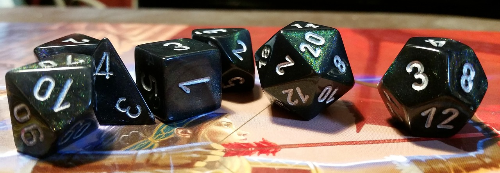

#Dugeons & Dragons Dice Roller

##Description

When playing Dungeons and Dragons you need to create character sheets. Way to determine character stats in sheets is rolling the dice. 

Sadly, I have lost all my dice and I don't like the official online dice roller: 
https://www.wizards.com/dnd/dice/dice.htm
so I need to create my own Dungeons & Dragons Dice Roller.

##Formal Inputs & Outputs

###Input description

Input must will contain one line in the form of "[Number]d[Number]".

#####For example:

* 2d6

* 3d6

* 4d9

* 2d10

* 4d12

* 5d4

If you've played D&D you probably recognize those, but for the rest of you, this is what those mean:

The first number is the number of dice to roll, the d just means "dice", it's just used to split up the two numbers, and the second number is how many sides the dice have. 

So the above example of "2d6" means "roll 2 6-sided dice". Also, just in case you didn't know, in D&D, not all the dice we roll are the normal cubes. 

A d6 is a cube, because it's a 6-sided die, but a d20 has twenty sides, so it looks a lot closer to a ball than a cube.

The first number, the number of dice to roll, can be any integer between 1 and 100, inclusive.

The second number, the number of sides of the dice, can be any integer between 2 and 100, inclusive.

###Output description

Output should be the sum of all the rolls of that specified die. So if your input is "2d6", the output should look something like

`8`

Just a single number, you rolled a 6-sided dice, and they added up to 8.

##Notes/ Additional Info

A dice roll is basically the same as picking a random number between 1 and 6 (or 12, or 20, or however many sides the die has). 

In addition to the sum of dice roll for your output, this programm will print out the result of each roll on the same line, using a format that looks something like

* 14: 6 3 5

* 22: 10 7 1 4

* 9: 9

* 11: 3 2 2 1 3

You can manually input more rolls without the need to start the program again, leave the program open and every time you want to roll more dice, you just type it in and hit enter.

If you make a wrong input ex. not in the form of "[Number]d[Number] this programm will tell you where you made a mistake.
